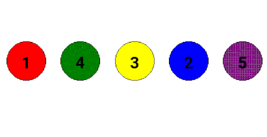

Permutations and combinations are fundamental concepts in mathematics and computer science. They help us count, arrange, and analyze different ways objects can be ordered or selected. These ideas are not only important in theory but also have practical applications in algorithm design, cryptography, and problem solving.

---

### What are Permutations?

A **permutation** is an arrangement of objects in a specific order. For example, the different ways to arrange the numbers 1, 2, and 3 are:

- 1, 2, 3
- 1, 3, 2
- 2, 1, 3
- 2, 3, 1
- 3, 1, 2
- 3, 2, 1

Permutations are used whenever the order of objects matters. The number of permutations of $n$ distinct objects is $n!$ (n factorial).

Permutations can be visualized as arranging colored balls in a row, as shown below:

 <small>Figure: One possible permutation (arrangement) of five colored balls labeled 1, 4, 3, 2, 5.</small>

---

### Permutations and Balancing Problems

Permutations and combinations are especially useful in balancing and arrangement problems. For example, in the classic problem of balancing weights on a scale, you may need to consider all possible ways to arrange or select weights to achieve balance. This requires both combinatorial reasoning and algorithmic thinking.

---

In this experiment, you will solve two main problems that require permutations, combinations, and recursive thinking:

### 1. Balancing a Given Sum

**Task:** Given a set of unique weights and a target sum, determine in how many ways you can balance the sum using one or more weights. Each arrangement is counted only once, regardless of which side the weights are placed on.

**Hint:** Use combinations and recursive algorithms to explore all possible ways to achieve the target sum.

### 2. Balancing with a Single Weight on One Side

**Task:** Given a set of weights, count the number of ways to balance the scale such that only one weight is on the right side and any combination of the remaining weights is on the left side.

**Hint:** For each weight, try placing it on the right and use combinations of the others on the left to achieve balance.

---

By mastering these techniques, you will be able to solve a wide range of combinatorial and algorithmic problems. The skills you learn here are foundational for advanced topics in mathematics, computer science, and competitive programming.
